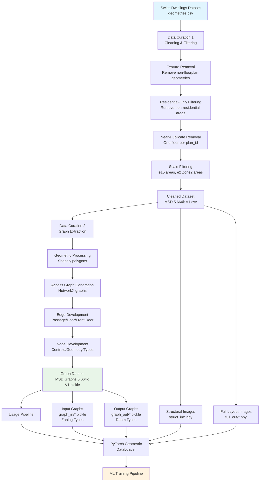
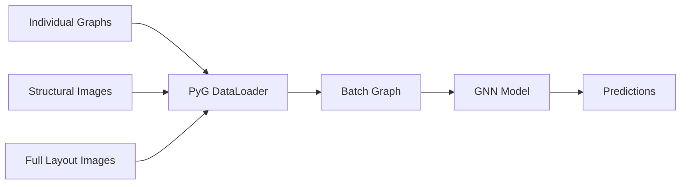
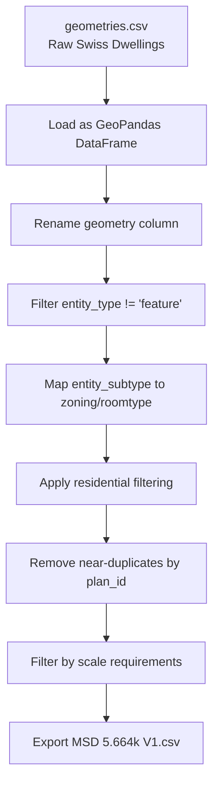

# Modified Swiss Dwellings (MSD) - System Architecture and Theory of Operation

## System Overview

The Modified Swiss Dwellings (MSD) system processes the Swiss Dwellings dataset through a multi-stage pipeline to create machine learning-ready floor plan data with both structural representations and graph-based access patterns.

## System Architecture



## Processing Stages

### Stage 1: Data Cleaning and Filtering

| Step | Process | Input | Output | Reduction |
|------|---------|--------|---------|-----------|
| 1 | Feature Removal | Raw geometries | Non-floorplan elements removed | - |
| 2 | Residential Filtering | Filtered geometries | Residential-only floors | -2,305 floors (16.6%) |
| 3 | Near-Duplicate Removal | Residential floors | Unique plan layouts | -4,395 floors (31.6%) |
| 4 | Scale Filtering | Unique layouts | Medium-large scale floors | -1,541 floors (11.1%) |

**Final Result**: ~5,664 high-quality residential floor plans

### Stage 2: Graph Extraction

| Component | Description | Attributes |
|-----------|-------------|------------|
| **Nodes** | Individual rooms/areas | `centroid`, `geometry`, `roomtype`, `zonetype` |
| **Edges** | Connectivity between rooms | `passage`, `door`, `front_door` |
| **Graph Types** | Room vs Zoning graphs | Room: detailed categories, Zoning: 4 zones |

#### Edge Types and Connectivity Rules

| Edge Type | Condition | Description |
|-----------|-----------|-------------|
| `passage` | Polygons d 0.04m apart | Direct walkable connection |
| `door` | Door polygon d 0.05m from both areas | Interior door connection |
| `front_door` | Front door polygon d 0.05m from both areas | Entrance connection |

#### Node Classification Systems

**Zoning Types** (4 categories):
- Zone 1: Public/semi-public spaces
- Zone 2: Private living spaces  
- Zone 3: Service areas
- Zone 4: Circulation spaces

**Room Types** (Multiple detailed categories):
- Kitchen, Bedroom, Living Room, Bathroom, etc.
- Mapped from original Swiss Dwellings subtypes

### Stage 3: Data Representation

| Format | Purpose | Structure |
|--------|---------|-----------|
| **struct_in** | Structural elements | 3D array: [H, W, 3] - structure + xy coords |
| **graph_in** | Input graphs (zoning) | NetworkX with zoning_type attributes |
| **full_out** | Complete room layouts | 3D array: [H, W, 3] - rooms + xy coords |
| **graph_out** | Output graphs (rooms) | NetworkX with room_type + geometry |

## Machine Learning Pipeline

### PyTorch Geometric Integration



**Key Features**:
- Graph batching via node concatenation
- Images as graph-level attributes
- Automatic stacking by PyG framework
- Support for paired input/output graphs

### Data Statistics

| Metric | Value |
|--------|-------|
| Total Floor Plans | ~5,664 |
| Average Rooms per Floor | 15+ |
| Minimum Zone 2 Rooms | 2+ |
| Graph Formats | 2 (zoning + room types) |
| Image Resolution | Variable (with coordinate mapping) |

## Key Algorithms

### Graph Connectivity Algorithm
1. **Spatial Analysis**: Calculate distances between all room polygon pairs
2. **Door Matching**: Find doors within threshold distance of room pairs  
3. **Edge Classification**: Assign passage/door/entrance types based on spatial relationships
4. **Validation**: Ensure graph connectivity and remove isolated components

### Filtering Pipeline Optimization
- **Parallel Processing**: Geometric operations use efficient libraries (Shapely, GeoPandas)
- **Memory Management**: Incremental filtering reduces memory footprint
- **Performance**: Complete pipeline processes 13k+ floors in seconds

## CSV Data Representation

### Input: Swiss Dwellings geometries.csv

The original Swiss Dwellings dataset is stored as a CSV file with geometric and hierarchical information:

| Column | Type | Description | Example Values |
|--------|------|-------------|----------------|
| `geometry` | String/WKT | Well-Known Text polygon coordinates | `POLYGON((x1 y1, x2 y2, ...))` |
| `entity_type` | String | High-level category | `area`, `feature`, `door` |
| `entity_subtype` | String | Detailed room/element type | `KITCHEN`, `BEDROOM`, `LIVING_ROOM`, `ELEVATOR` |
| `apartment_id` | Integer | Unique apartment identifier | 12345 |
| `site_id` | Integer | Building site identifier | 678 |
| `building_id` | Integer | Building identifier | 90 |
| `floor_id` | Integer | Floor identifier | 1234 |
| `plan_id` | Integer | Floor plan layout identifier | 567 |
| `unit_id` | Integer | Individual unit identifier | 89 |
| `area_id` | Integer | Room/area identifier | 456 |
| `elevation` | Float | Floor height/level | 0.0, 3.2, 6.4 |

#### Hierarchical Structure

The Swiss Dwellings dataset uses a nested ID system:
```
site_id (building complex)
├── building_id (individual building)  
    ├── plan_id (floor layout template)
        ├── floor_id (specific floor instance)
            ├── apartment_id (apartment unit)
                └── area_id (individual room/space)
```

#### Entity Classification

**Entity Types**:
- `area`: Room/space polygons (kitchen, bedroom, etc.)
- `feature`: Non-room elements (removed in processing)
- `door`: Door geometries for connectivity analysis

**Entity Subtypes** (Original Swiss Dwellings categories):
- **Residential**: `KITCHEN`, `BEDROOM`, `LIVING_ROOM`, `BATHROOM`, `CORRIDOR`
- **Non-Residential**: `OFFICE`, `MEDICAL_ROOM`, `WAREHOUSE`, `TECHNICAL_AREA`
- **Features**: `BATHTUB`, `STAIRS`, `RAILING` (removed during processing)

### Output: MSD 5.664k (V1).csv

The processed MSD dataset retains the original columns and adds new classification columns:

#### Additional Columns

| Column | Type | Description | Values |
|--------|------|-------------|--------|
| `zoning` | String | Zone classification | `Zone1`, `Zone2`, `Zone3`, `Zone4` |
| `roomtype` | String | Standardized room type | `kitchen`, `bedroom`, `living`, `bath`, etc. |

#### Data Transformations

1. **Geometry Renaming**: `geometry` → `geom` (to avoid GeoPandas conflicts)
2. **Type Mapping**: `entity_subtype` → `zoning` + `roomtype` via mapping dictionaries
3. **Filtering Applied**: Only residential areas retained
4. **Deduplication**: One floor per `plan_id` (lowest elevation)
5. **Scale Filtering**: Minimum 15 areas, minimum 2 Zone2 rooms

#### Zone Classification System

| Zone | Description | Example Subtypes |
|------|-------------|------------------|
| **Zone1** | Public/Semi-Public | `LIVING_ROOM`, `DINING_ROOM`, `ENTRANCE` |
| **Zone2** | Private Spaces | `BEDROOM`, `STUDY`, `DRESSING_ROOM` |
| **Zone3** | Service Areas | `KITCHEN`, `BATHROOM`, `LAUNDRY`, `STORAGE` |
| **Zone4** | Circulation | `CORRIDOR`, `HALLWAY`, `STAIRCASE` |

#### Room Type Standardization

Original subtypes are mapped to standardized room categories:
- `KITCHEN` → `kitchen`
- `BEDROOM` → `bedroom`  
- `LIVING_ROOM` → `living`
- `BATHROOM` → `bath`
- `CORRIDOR` → `circulation`

### Data Quality Metrics

| Metric | Original SD | Processed MSD |
|--------|-------------|---------------|
| Total Records | ~500k+ geometries | ~85k+ geometries |
| Floor Plans | ~13,900 | ~5,664 |
| Entity Types | 3 (area, feature, door) | 1 (area only) |
| Entity Subtypes | 100+ categories | ~50 residential categories |
| Residential Only | Mixed use | 100% residential |
| Duplicate Plans | Many per plan_id | 1 per plan_id |

### CSV Processing Pipeline



## Applications

The MSD dataset supports:
- **Graph Neural Networks**: Node/edge prediction tasks
- **Generative Modeling**: Floor plan synthesis and completion  
- **Spatial Analysis**: Room connectivity and circulation patterns
- **Multi-modal Learning**: Combined image and graph representations